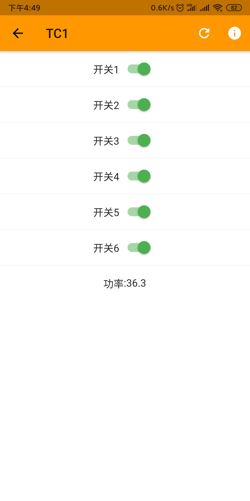

# phicomm_tc1_a1（免费开源固件）
斐讯TC1 A1版接入OpenIoTHub（https://github.com/OpenIoTHub）
* 斐讯插排交流QQ群：251227638（验证：斐讯）  

###### 基于[zTC1](https://github.com/a2633063/zTC1) 和 [tc1_mqtt ](https://github.com/cnk700i/tc1_mqtt) ，使用http接口进行控制

斐讯TC1 a1刷机控制请参考：[教程](./%E5%B7%A5%E5%85%B7%E5%92%8C%E6%96%87%E6%A1%A3)

如果是斐讯DC1插排请参考：[斐讯DC1](https://github.com/IoTDevice/phicomm_dc1)

#### 适用于tc1 a1，刷机后通电（小心触电），连接类似的Easylink_###的wifi，返回手机或者pc连接后打开http://10.10.10.1 开始配网下一步然后插排就会显示结果并连接wifi，然后使用OpenIoTHub（ https://github.com/OpenIoTHub ） apk在刚刚给插排配置的同一个路由器网络里面查看控制界面

##### 如果要远程请参看apk的网关相关项目

#### 插排配置wifi后需要重新配置wifi请长按按钮十秒以上再重复上述步骤

### app操作界面 

## 致谢
以下排名不分先后，为随机。
- [a2633063](https://github.com/a2633063) 首发的tc1程序
- [cnk700i](https://github.com/cnk700i)：  精简的项目和bug修复